# EIM RF — legacy handheld environment (pre-migration baseline)

> **NOT A TYSON FOODS SYSTEM.** Internal demo prop. All plants, bins, materials,
> pallets and users are fictional (GS1 example company prefix `0614141`).

A runnable replica of how warehouse RF inventory works today on the plant floor:
a handheld opens a remote desktop into a Windows VM, and a .NET WinForms app on
that VM does all the work, calling SAP over RFC synchronously, one round trip at a
time. It exists to produce an honest, measured "before" number.

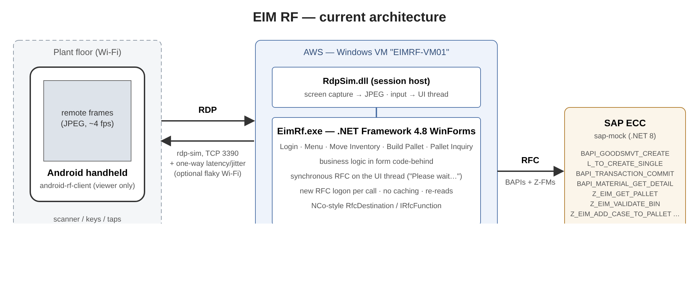

```
Android handheld ──RDP (rdp-sim)──▶ Windows VM: EimRf.exe (.NET Fx 4.8 WinForms) ──RFC──▶ SAP (sap-mock)
```

| Folder | What | Tech |
|---|---|---|
| `legacy-windows/` | The RF app: Login, Main Menu, 1 Move Inventory, 2 Build Pallet, 3 Pallet Inquiry. Synchronous RFC on the UI thread, new logon per call, re-reads after every commit, no caching. Writes `timings.csv`. | .NET Framework 4.8 WinForms, SDK-style csproj |
| `rdp-sim/` | **Stand-in for RDP**, loaded into the app only when enabled. Streams JPEG frames of the app window at 4 fps and injects taps/keys/text; adds per-message latency and optional Wi-Fi drops. Production handhelds use real Microsoft RDP. | .NET Framework 4.8 class library |
| `android-rf-client/` | Thin remote-session viewer for the handheld: frame view, tap/key forwarding, SCAN list of seeded barcodes, RTT strip, Reconnecting overlay. No business logic. | Kotlin, minSdk 26, no dependencies |
| `sap-mock/` | SAP ECC stand-in: RFC-over-HTTP (`/rfc/logon`, `/rfc/call`), BAPIs + Z function modules, stateful commit/rollback, seeded fictional inventory, per-transaction call counts at `/stats`. | .NET 8 minimal API |
| `config/demo-profile.json` | **Every latency knob** (SAP logon/call/processing, RDP latency/jitter/fps, flaky Wi-Fi). Profiles `demo` (default), `lan`, `flaky-wifi`; override with `EIMRF_PROFILE`. | JSON |
| `scripts/` | `start-demo.ps1` (Windows) / `start-demo.sh` (Linux + Mono) start everything; `run-workflows.py` drives all three workflows through the RDP path and prints per-step timings + SAP call counts. | PowerShell, bash, Python 3 stdlib |
| `docs/` | This file, [`BASELINE.md`](BASELINE.md), [`DEMO_SCRIPT.md`](DEMO_SCRIPT.md), [`INTERFACES.md`](INTERFACES.md) (component contracts), `screenshots/`, `baseline/` raw timing data, `img/` diagram. | |

SAP latency lives only in `sap-mock` + the profile file; the WinForms app has no
artificial sleeps. What makes it slow is the architecture: ~2–5 fresh RFC logons and
3–5 sequential calls per scan, plus the RDP hop.

## Run it on a fresh Windows machine (the real target)

Prerequisites: Windows 10/11 or Server 2019+, .NET 8 SDK
(`winget install Microsoft.DotNet.SDK.8`), .NET Framework 4.8 runtime (built in),
Python 3 for the workflow script.

```powershell
git clone https://github.com/COG-GTM/event-driven-devin.git
cd event-driven-devin\stacks\51d7cf9e
.\scripts\start-demo.ps1 -Build            # sap-mock on :8400, EimRf.exe with rdp-sim on TCP 3390
python scripts\run-workflows.py            # scripted run of all three workflows
```

`start-demo.ps1 -Profile flaky-wifi` starts with Wi-Fi drops on. The WinForms
window can be driven directly with the keyboard (see `INTERFACES.md` §5) without
a handheld. Open TCP 3390 in the Windows firewall if the handheld is on another
machine.

## Run it on Linux (dev host, Mono)

The same `EimRf.exe`/`RdpSim.dll` build runs under Mono 6.12 on a virtual X display.

```bash
sudo apt-get install -y mono-complete xvfb python3 curl
curl -sSL https://dot.net/v1/dotnet-install.sh | bash -s -- --channel 8.0
cd stacks/51d7cf9e
DOTNET=~/.dotnet/dotnet ./scripts/start-demo.sh
python3 scripts/run-workflows.py
```

sap-mock alone also runs in Docker:
`docker build -f sap-mock/Dockerfile -t eimrf-sap-mock . && docker run -p 8400:8400 eimrf-sap-mock`.

## Handheld (Android)

APK: build with `cd android-rf-client && ./gradlew assembleDebug` (JDK 17, Android SDK 34)
→ `app/build/outputs/apk/debug/app-debug.apk`, or use the attached `eimrf-debug.apk`.

```bash
adb install -r app/build/outputs/apk/debug/app-debug.apk
adb shell am start -n com.example.eimrf/.MainActivity
```

Default host is `10.0.2.2:3390` (the emulator's alias for the host machine).
Long-press the bottom strip to change host/port; settings are persisted.

## Screens

Real captures of the WinForms window (480×640) on the Windows VM, in `screenshots/`:

| | | | |
|---|---|---|---|
| 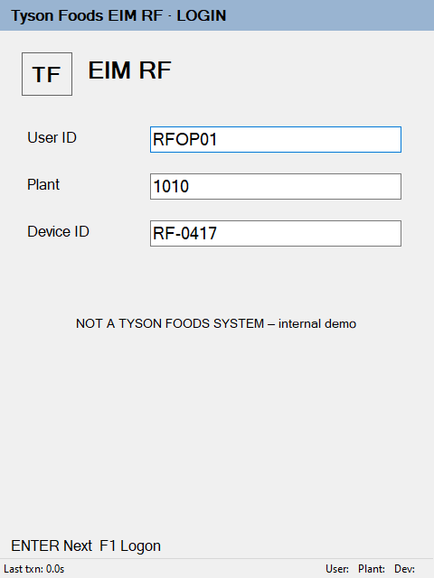 Login | 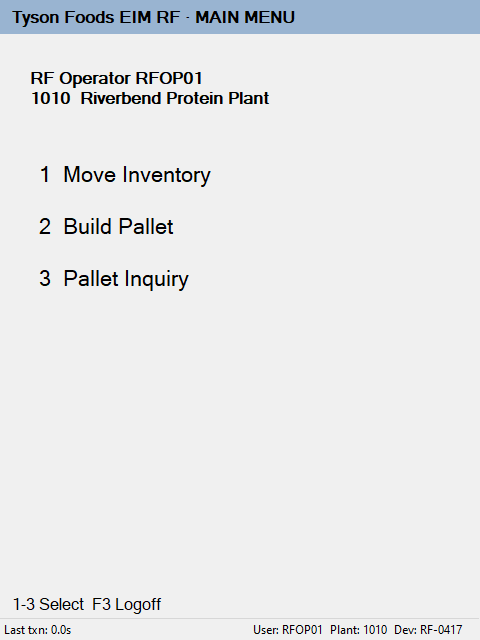 Main menu | 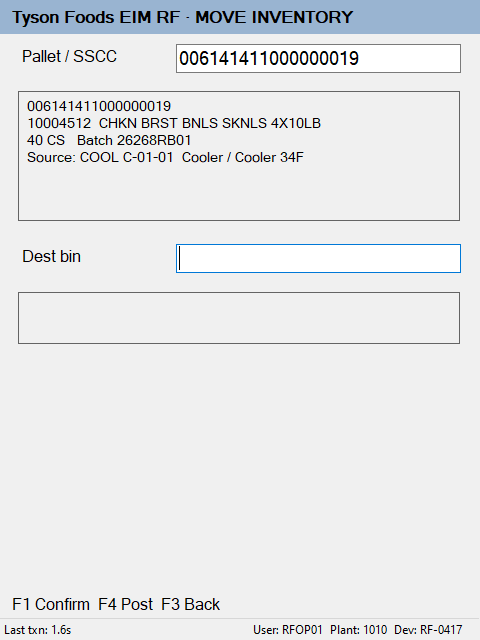 Move: pallet scanned | 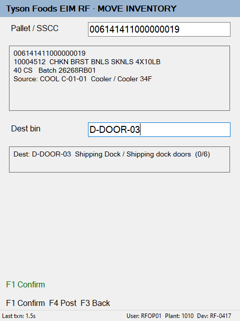 Move: dest scanned |
| 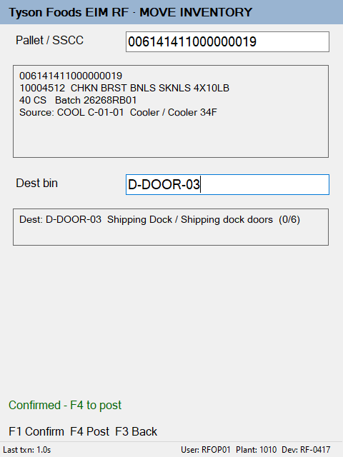 Move: confirmed | 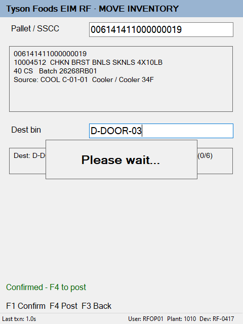 Please wait... | 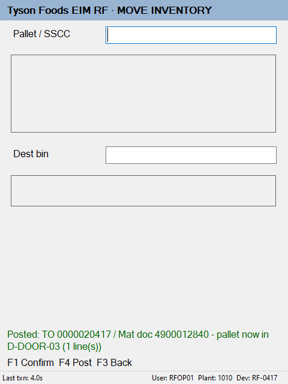 Move: posted | 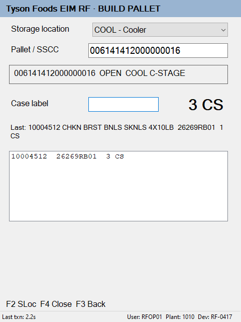 Build: cases scanned |
| 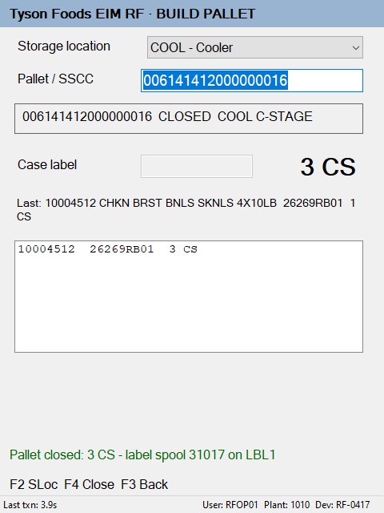 Build: closed | 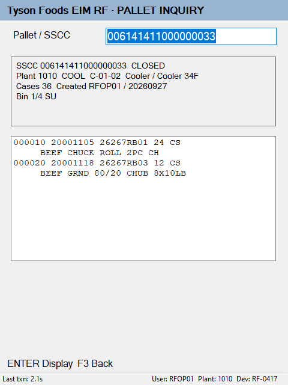 Pallet inquiry | 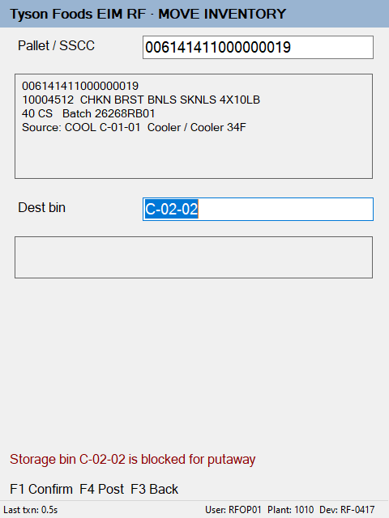 Error: blocked bin | 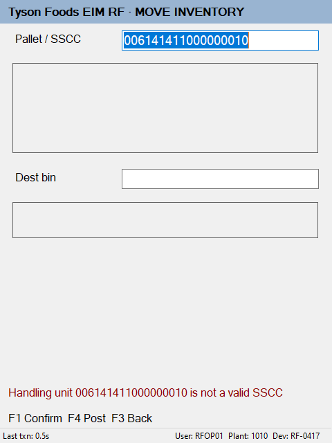 Error: bad SSCC |

More error states: `winforms-12` … `winforms-15`.

## What was verified

See [`BASELINE.md`](BASELINE.md#verification) for exactly what was run, where, and what was not.
